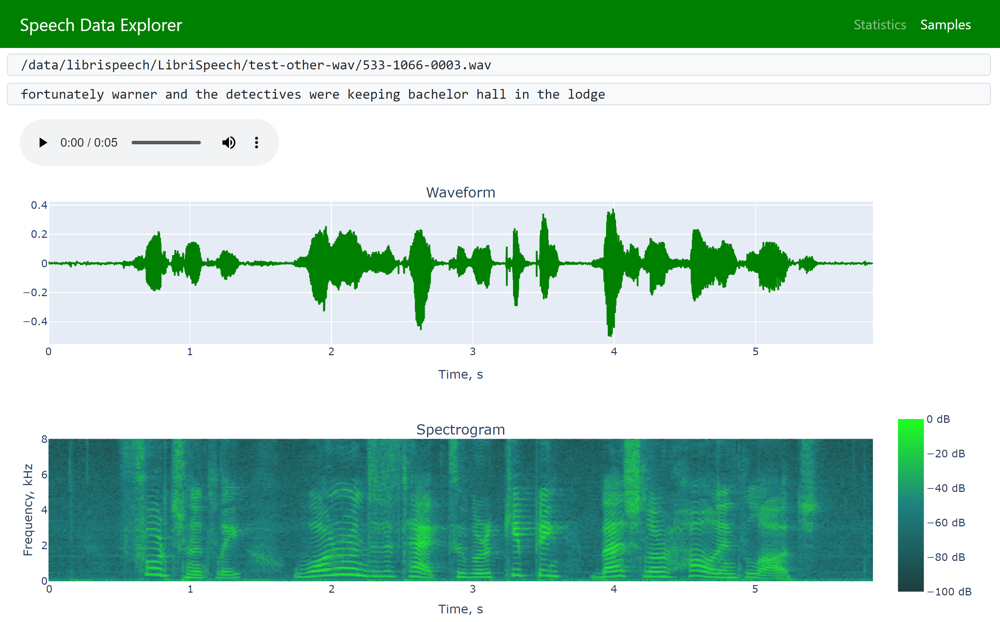

Speech Data Explorer
--------------------

[Dash](https://plotly.com/dash/)-based tool for interactive exploration of ASR/TTS datasets.

Features:
- dataset's statistics (alphabet, vocabulary, duration-based histograms)
- navigation across dataset (sorting, filtering)
- inspection of individual utterances (waveform, spectrogram, audio player)
- errors' analysis (Word Error Rate, Character Error Rate, Word Match Rate, Mean Word Accuracy, diff)
- visually compare ASR models 

Please make sure that requirements are installed. Then run:
```
python data_explorer.py path_to_manifest.json
```

To use visual comparison:
```
python data_explorer.py path_to_manifest.json -nc pred_text_{model_1_name} pred_text_{model_2_name}
```

JSON manifest file should contain the following fields:
- "audio_filepath" (path to audio file)
- "duration" (duration of the audio file in seconds)
- "text" (reference transcript)

Errors' analysis requires "pred_text" (ASR transcript) for all utterances.
Visuall comparison requires two or more "pred_text_{model_name}" fields

Any additional field will be parsed and displayed in 'Samples' tab.

Speech Data Explorer comparation tool
--------------------
When the input arguments contain -nc the comparative tool tab appears.
There will be few dropdown inputs. The first two are responsible for the axes of the graph.
Others explained inside fields.
In some cases dots on the graph could overlay each other, to avoid that you can enable dot spacing parametr and and specify the appropriate radius.
You can also filter the data that appears on the chart. Syntax example: {column_name_1} >= 100 and {column_name_2} < 100 (lower case)



